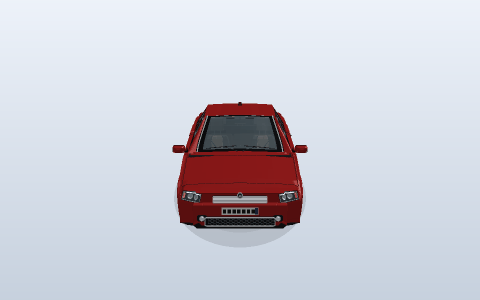
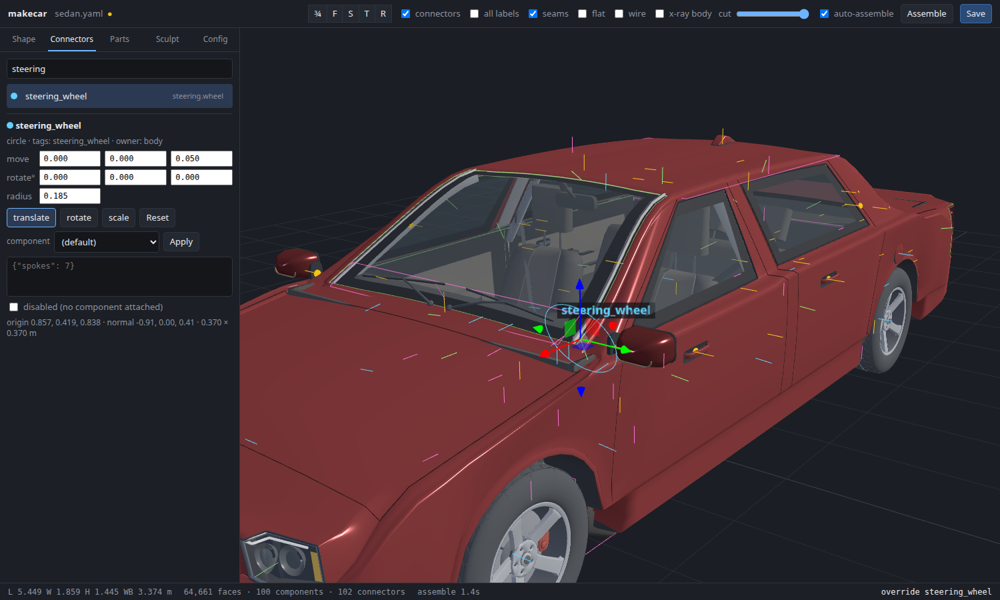

# makecar



MakeHuman but for cars. You write a config file and it builds the whole car, the outside and the inside.

## How It Works

It works the same way MakeHuman does for people. There is one base body mesh, and its topology never changes. A target is a set of offsets for each vertex on that mesh. A slider sets how much of a target gets added. Vertex *j* of every ring is always the same feature (the sill, the belt line, the roof rail), so a target made on one body still works on any other body.

The body has:

- 39 shape sliders, like `wheelbase`, `roof_height` and `a_pillar_lean`. Each one has an `-incr` and a `-decr` target.
- 7 style macros: hatchback, wagon, suv, pickup, coupe, sports and van. Sedan is the base. They blend, so `{sedan: 0.5, wagon: 0.5}` gives a shooting brake.
- 4 sculpt targets: `haunches`, `side_crease`, `wedge` and `roof_bubble`.


The morphed body gives out connectors. These are like the joints in MakeHuman. A connector is a point, polygon, rectangle or circle, and it is placed from vertex groups on the morphed mesh. That way the connectors follow every slider.

Components attach to connectors. These are the wheels, seats, lamps, dashboard and so on. Some components use targets too. For instance, a wheel connector that has a bigger radius drives the `radius` slider on the wheel. Components can also have their own connectors (the dashboard has a cluster, a screen and vents), and those get filled in the same way.

To add a component, register it with `@register` and set `default_for` to the tags it should take over.

## Install

```bash
pip install numpy pyyaml
```

That is all it needs. The tests also need pytest.

## Run

```bash
python -m makecar samples -o output
```

This builds every config in `configs/`. Some other commands:

```bash
python -m makecar build configs/coupe.yaml -o output --set wheelbase=0.4 --seed 3
python -m makecar random -n 4 --style hatchback -o output
python -m makecar list-modifiers
python -m makecar list-components
python -m makecar connectors configs/suv.yaml
python -m pytest -q
```

The first run builds the target library and caches it in `~/.cache/makecar/` (it takes about 4 seconds). You can set `MAKECAR_CACHE` to put it somewhere else. After that a car builds in under a second. The PNG previews take a few more seconds because the renderer is plain numpy.

## Config

```yaml
name: gt_coupe
description: Two-door GT with muscular haunches
seed: 6
body:
  style: coupe                    # one style, or a blend like {suv: 0.7, coupe: 0.3}
  modifiers:                      # sliders from -1 to 1
    cowl_offset: 0.3              # long hood
    roof_height: -0.15
    width: 0.2
  sculpt: {haunches: 0.8, wedge: 0.5}
  hints: {door_count: 2, drive: left, transmission: manual, seat_rows: auto, fuel_side: left}
  random: {amount: 0.0}           # jitters the sliders using the seed
palette: {paint: "#151820", interior: "#3a1f1c", seat: "#6b2f28", rim: "#d0d3d8"}
components:
  defaults: true                  # put the default component on every connector
  disable: [antenna, roof_rail*]  # connector name, tag or glob
  assign:
    wheel: {component: wheel.alloy, options: {spokes: 10, spoke_width: 0.4}}
    exhaust: {component: exhaust.tip, options: {dual: true}}
    roof_rail: roof.rails
output:
  formats: [obj, svg, png, json]  # "targets" also writes the used .target files
  views: [three_quarter_front, three_quarter_rear, side, top, front, rear, interior_cutaway, interior_side, driver]
  blueprint_theme: blueprint      # or paper
variants:                         # more cars from the same file
  - name: gt_coupe_wide
    body: {modifiers: {width: 0.8}}
```

`body.base_params` makes the base mesh again with different numbers. The targets still go on top of it. It is like editing the base mesh in MakeHuman.

## Measured Cars

`configs/measured/` has a 2022 Civic, a Model 3 and an Aventador. I traced their side profiles from Wikimedia Commons photos (the photos and credits are in `references/`). The code for this is in `makecar/reference/`. It calibrates the photo off the wheel hubs, traces the edges and then puts the traced curves into `base_params`. The roofline is off by about 5 mm on all three. Only the side is measured, so the front, back and top views are still generic.

## Viewer

```bash
python -m makecar viewer configs/sedan.yaml
```

This opens http://127.0.0.1:8765. It is a local web app that uses the python `http.server` and a copy of three.js.



- **Shape:** every slider in groups. The body morphs while you drag.
- **Connectors:** move, rotate or scale any connector with `g`, `r` and `s`. The change gets written into `connectors.overrides` in the config, so `makecar build` makes the same car.
- **Sculpt:** a mirrored brush that pushes or pulls the body. *Save as target* writes a `.target` file and adds it as a `custom/<name>` slider.
- **Config:** the live yaml. You can edit it and save it from here.

## Output

Each car goes in `output/<name>/`:

- `car.obj` and `car.mtl`: the whole car, with one object group per component
- `body.obj`: only the body
- `connectors.json`: every connector and what is attached to it
- `assembly.json`: slider values, measurements, the component tree and timings
- `blueprint.svg`: side, front, plan and rear views with mm dimensions
- `connector_map.svg`: every connector drawn and labelled
- `preview.png` and `interior.png`: the renders
- `spec.txt`: a summary you can read


## Turntable Gif

```bash
pip install pillow
python -m scripts.turntable_gif -o output/turntable.gif
```

This is how I made the gif at the top. It morphs through all 8 body styles while the camera does one full orbit, and it loops back to sedan at the end. It uses the same style blending the config supports. The script only moves the blend a little each frame. `--frames-per-style` sets how many frames each style gets, which also sets how slow the morph looks. `--size` sets the resolution.

## Layout

```
makecar/
  geometry/    mesh, frames, curves, primitives
  morph/       Target, Modifier, MorphableMesh
  body/        params, the loft generator, styles, targets, connectors, CarBody
  components/  exterior and interior parts
  reference/   photo tracing for the measured cars
  viewer/      the web viewer
  export/      obj, svg blueprint, png renderer
configs/       sample configs
references/    reference photos and credits
scripts/       helper scripts
tests/         pytest
```
