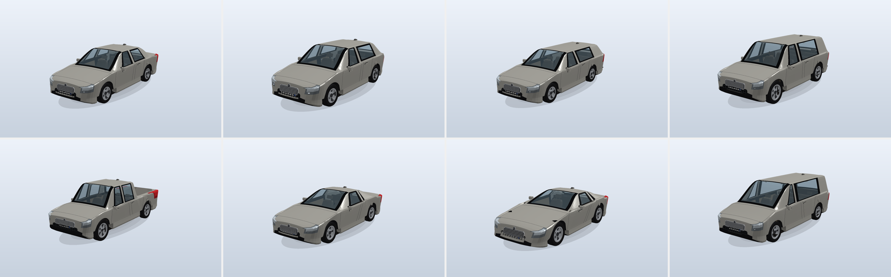
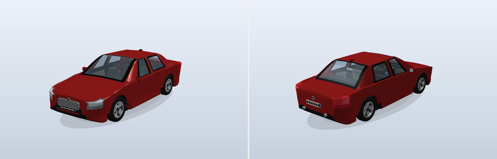
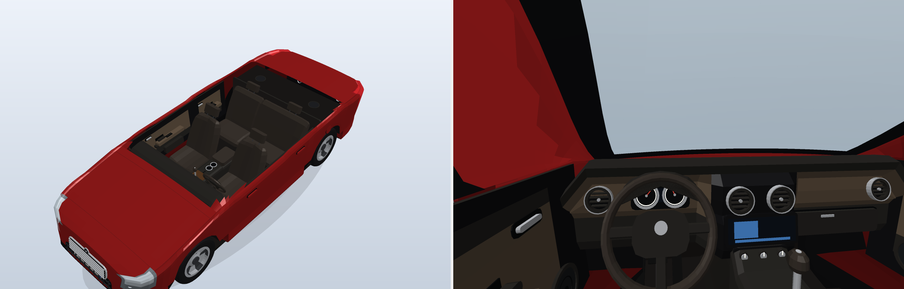
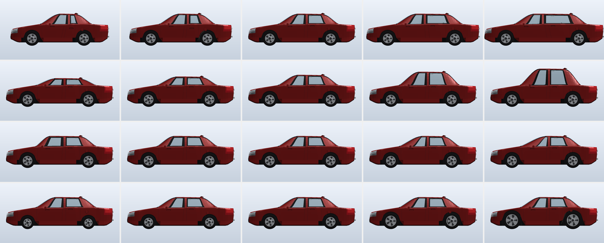

# makecar — MakeHuman for cars



`makecar` procedurally models complete cars — exterior **and** interior — from a
config file, using the same ideas that make [MakeHuman](http://www.makehumancommunity.org/)
work for people:

| MakeHuman                         | makecar                                                     |
|-----------------------------------|-------------------------------------------------------------|
| one base mesh, fixed topology     | one parametric body loft with fixed topology (`body/generator.py`) |
| targets = per-vertex offsets      | `Target` objects, differential + sculpted (`morph/`, `body/targets.py`) |
| modifiers / sliders in [-1, 1]    | `Modifier`s: 39 shape sliders, 4 sculpts, 7 style macros    |
| macro targets (gender, age …)     | style macros: hatchback, wagon, suv, pickup, coupe, sports, van |
| joints / landmarks follow the mesh| **connectors** derived from vertex groups of the morphed mesh |
| proxies / clothes fitted to body  | **components** fitted to connectors, themselves target-based |

```
config.yaml ──► CarBody (base + targets) ──► body mesh + connectors
                                                  │
                     components (wheel, seat, dashboard …) fitted to connectors
                     (components can emit connectors of their own → recursive)
                                                  │
                    output/<name>/  car.obj  body.obj  connectors.json  assembly.json
                                    blueprint.svg  connector_map.svg  preview.png  interior.png  spec.txt
```





## Quick start

```bash
pip install numpy pyyaml            # the only runtime dependencies
python -m makecar samples -o output # builds every config in configs/ (the shipped samples)
python -m makecar build configs/coupe.yaml -o output --set wheelbase=0.4 --seed 3
python -m makecar list-modifiers    # all sliders with their groups and ranges
python -m makecar list-components   # registered components, what they accept, what they default for
python -m makecar connectors configs/suv.yaml   # every connector a config produces and what attaches
python -m makecar random -n 4 --style hatchback -o output   # random variations
python -m pytest -q                 # test-suite
```

The first run builds the body target library (~4 s) and caches it in
`~/.cache/makecar/` (override with `MAKECAR_CACHE`); afterwards a car builds in
well under a second, plus a few seconds for the PNG previews (pure-numpy
rasteriser — no renderer dependency).

## Config file

```yaml
name: gt_coupe
description: Two-door GT with muscular haunches
seed: 6
body:
  style: coupe                    # a macro target, or a blend: {suv: 0.7, coupe: 0.3}
  modifiers:                      # MakeHuman-style sliders in [-1, 1]
    cowl_offset: 0.3              #   long hood
    roof_height: -0.15
    width: 0.2
  sculpt: {haunches: 0.8, wedge: 0.5}   # hand-authored procedural targets
  hints: {door_count: 2, drive: left, transmission: manual, seat_rows: auto, fuel_side: left}
  random: {amount: 0.0}           # jitter the sliders for variations (uses `seed`)
palette: {paint: "#151820", interior: "#3a1f1c", seat: "#6b2f28", rim: "#d0d3d8"}
components:
  defaults: true                  # attach the default component to every connector
  disable: [antenna, roof_rail*]  # selectors: connector name, tag or glob
  assign:                         # override component and/or options per selector
    wheel: {component: wheel.alloy, options: {spokes: 10, spoke_width: 0.4}}
    exhaust: {component: exhaust.tip, options: {dual: true}}
    roof_rail: roof.rails         # opt-in component for a connector with no default
output:
  formats: [obj, svg, png, json]  # add "targets" to also dump the used targets as .target files
  views: [three_quarter_front, three_quarter_rear, side, top, front, rear, interior_cutaway, interior_side, driver]
  blueprint_theme: blueprint      # or "paper"; blueprint_connectors: true overlays every connector on the sheet
variants:                         # more cars from the same file (deep-merged over the base config)
  - name: gt_coupe_wide
    body: {modifiers: {width: 0.8}}
```

`body.base_params` (advanced) regenerates the *base* mesh with different
canonical parameters; targets are still applied on top, exactly like editing the
MakeHuman base mesh.

## The body: a fixed-topology loft with targets

`body/generator.py` lofts 45 cross-section rings (64 vertices each) plus two
fascia caps. Every ring is sampled from ten *semantic* control points —
floor edge, wheel-well, sill, belt line, shoulder, roof rail, roof centre … —
with a fixed number of samples per segment, so vertex *j* of every ring is
always the same feature (sill, glass base, roof rail …) no matter what the
parameters are. Two independent chains of longitudinal breakpoints (wheel arches
vs. greenhouse features) share the ring index, which lets both wheel arches and
window apertures have clean edges without ever changing topology.

Because the topology is fixed, `body/targets.py` derives targets exactly the way
MakeHuman targets were made: generate a variant, subtract the base.

* 39 **differential modifiers** (`wheelbase`, `roof_height`, `windshield_length`,
  `a_pillar_lean`, `bed_depth`, …) each with a `-incr`/`-decr` target pair.
* 7 **style macros** (`style/hatchback` … `style/van`) — full presets turned into
  unipolar targets; they blend (`{sedan: 0.5, wagon: 0.5}` is a shooting brake).
* 4 **sculpt targets** written as displacement fields (`sculpt/haunches`,
  `sculpt/side_crease`, `sculpt/wedge`, `sculpt/roof_bubble`).

The body mesh carries *zones* (apertures for glass and lamps, underbody, wheel
wells, bed) and *vertex groups* (arch lips, feature lines, rings at the cowl /
pillars / deck, nose & tail). Apertures are cut out of the shell and handed to
components as polygon connectors.

## Connectors

`connectors.py`:

```
Connector
 ├── PointConnector                  mirrors, handles, badges, antenna, shifter, grab handles …
 └── PolygonConnector                windows, lamps, dashboard, headliner, door cards
      ├── RectangleConnector         seats, grille, plates, console, floor, pedals, cluster, screen …
      └── CircleConnector            wheels, steering wheel, exhaust, fuel cap, vents, speakers, cup holders
```

Each connector has a `Frame` (origin + axes; Z = mount normal, X = major
direction), `tags` used by the config selectors, and `meta` hints (tyre width,
H-point height, driver side, grid shape of an aperture …). The body emits ~50 of
them, all computed from vertex groups and measurements of the *morphed* mesh, so
they follow every slider. Components can emit sub-connectors (the dashboard
offers a gauge cluster, screen, vents, glove box, HVAC; the console offers a
shifter and cup holders; door cards offer speakers …) and the assembler resolves
them recursively.

Type matching uses the class hierarchy: a component that `accepts =
(PolygonConnector,)` attaches to rectangles and circles too.

## Components

`components/base.py` defines two flavours:

* `CarComponent` — plain procedural (grille, plates, lamps, mirrors, …).
* `MorphableComponent` — **the same logic as the body**: a dataclass of canonical
  parameters, a fixed-topology `generate()`, a list of `ModifierSpec`s turned into
  differential targets by `DifferentialTargetBuilder`, optional variant macros,
  and a `fit()` that maps the connector's geometry (radius, width, height,
  meta) onto slider values. `Wheel`, the seats, the dashboard and the steering
  wheel work this way, so a wheel connector with a bigger radius simply drives
  the `radius` slider of the wheel library.

Polygon-type components use `components/fills.py`: apertures come with the
grid shape of the loft region they were cut from, so a Coons patch reproduces the
body's curvature exactly (windshields stay double-curved; lamps wrap the corner).

Register your own with `@register` and set `default_for` to the tags it should
take over by default, or select it explicitly in the config.

## Interactive viewer

```bash
python -m makecar viewer configs/sedan.yaml      # opens http://127.0.0.1:8765
```

A local web app (Python `http.server` + a vendored three.js, no other
dependencies) for editing a car the way MakeHuman's GUI edits a human:

* **Shape** — every modifier as a slider, grouped (style macros, face/plan/section
  archetypes, proportions, greenhouse, sculpts, custom).  The body re-morphs on
  drag; components re-fit on a debounce.
* **Connectors** — every connector drawn in place, colour-coded by kind, with a
  translate/rotate/scale gizmo (`g`/`r`/`s`).  Moving, rotating or resizing one
  writes a `connectors.overrides` entry into the config, so the edit is real
  state that `makecar build` reproduces.  Per connector you can also pick the
  component, set its options, or disable it.
* **Sculpt** — a brush that pushes or pulls the shell along its normal, mirrored
  across the centreline.  *Save as target* writes a MakeHuman-style `.target`
  file into `body.custom_targets` and registers it as a `custom/<name>` slider.
* **Config** — the live YAML, editable and applied in place; *Save* writes the
  file, *Export* runs the normal OBJ/JSON output.

Toolbar: view presets, flat/wire/x-ray shading, a cutaway clip height, seams
and label toggles.  Everything the viewer changes is visible in the Config tab.

## Output folder

Each car gets `output/<name>/` with:

* `car.obj` + `car.mtl` — full assembly (object groups per component, materials)
* `body.obj` — the morphed shell alone, apertures removed
* `connectors.json` — every connector: kind, frame, outline/size, tags, meta, attached component
* `assembly.json` — effective modifier values, measurements, component tree, timings
* `blueprint.svg` — A3 general-arrangement sheet: side/front/plan/rear views with mm dimensions, interior plan and centre-plane section, title block
* `connector_map.svg` — side + plan views with every connector drawn and labelled (colour-coded by kind)
* `preview.png`, `interior.png` — rendered views (roof cutaway, half-cut, driver's eye)
* `spec.txt` — human-readable summary

`output/README.md` (written by `samples`) indexes all generated cars.

## Layout

```
makecar/
  geometry/    mesh container, frames, curves, primitives
  morph/       Target, Modifier, MorphableMesh, DifferentialTargetBuilder
  body/        params, generator (loft), styles (macros), targets, connectors, CarBody
  components/  base API + fills, exterior.py, interior.py
  export/      obj, svg blueprint, png rasteriser
  connectors.py  assembly.py  config.py  pipeline.py  cli.py
configs/       sample configs        tests/   pytest suite
```
